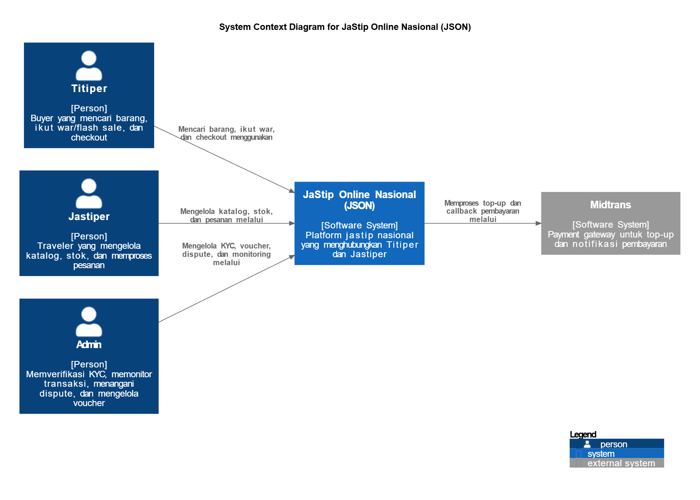
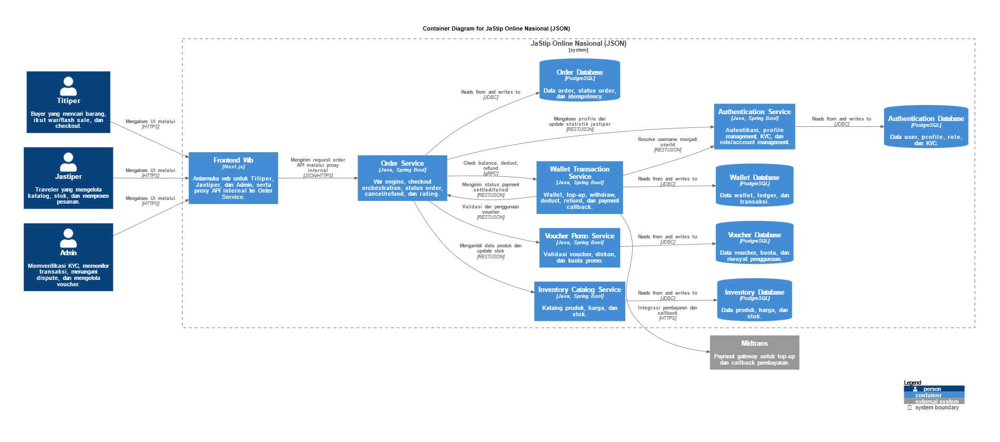

# Tutorial 9 - Bagian B: C4 Model & Risk Storming

## 1. C4 Model Architecture (Current State)

### A. System Context Diagram

**Penjelasan:** Diagram di atas menunjukkan konteks sistem utama dari JaStip Online Nasional (JSON). Sistem ini menghubungkan tiga aktor utama: Titiper (pembeli), Jastiper (penyedia jasa/traveler), dan Admin (pengelola platform). JSON juga berintegrasi dengan sistem eksternal, yaitu Midtrans, sebagai payment gateway untuk memproses transaksi dan callback pembayaran.

### B. Container Diagram

**Penjelasan:** Container Diagram ini membedah sistem JSON menjadi beberapa service independen berbasis microservices (Order, Wallet, Authentication, Voucher, dan Inventory). Setiap service memiliki database PostgreSQL masing-masing untuk menjaga batasan domain (database-per-service). Frontend Web (Next.js) berinteraksi dengan service-service ini melalui pemanggilan API internal.

### C. Deployment Diagram

**Penjelasan:** Deployment Diagram menggambarkan bagaimana kontainer-kontainer di atas di-deploy ke dalam infrastruktur. Frontend di-hosting menggunakan Vercel (Managed Node.js Runtime), sementara service backend berjalan di dalam Docker Containers pada Backend Infrastructure, lengkap dengan database server masing-masing.

---

## 2. Risk Storming Analysis

### Refleksi Risk Storming
Risk Storming diterapkan karena arsitektur saat ini tidak lagi cukup dinilai hanya dari sisi kelengkapan fitur, tetapi juga harus dilihat dari sisi risiko operasional jangka panjang. Ketika JSON berkembang dan digunakan dalam skala yang lebih besar, perhatian utama arsitektur bergeser ke aspek skalabilitas, konsistensi data, ketahanan sistem, dan observability pada banyak service yang saling terhubung.

Teknik ini membantu tim mengidentifikasi risiko secara sistematis berdasarkan kemungkinan terjadinya dan besar dampaknya, bukan hanya berdasarkan intuisi. Dengan memetakan risiko seperti overselling saat war, inkonsistensi antarservice, bottleneck pada Order Service, dan keterbatasan observability ke dalam matriks likelihood-impact, tim dapat memprioritaskan masalah yang paling penting untuk keberlanjutan sistem.

### Risk Likelihood-Impact Matrix

### Identifikasi & Mitigasi Risiko
Berdasarkan matriks di atas, kami memetakan risiko arsitektur beserta strategi mitigasinya:

| Titik Lemah / Risiko Arsitektur | Likelihood | Impact | Strategi Mitigasi / Solusi Arsitektural |
| :--- | :---: | :---: | :--- |
| **War Overselling Risk**  *(Risiko oversell saat flash sale/war)* | High (3) | High (3) | Mengimplementasikan **Flash Sale Reservation Cache** menggunakan Redis. Hal ini untuk mengelola *short-lived stock reservation* dan distributed locking yang jauh lebih cepat daripada langsung menembak ke database relasional. |
| **Cross-Service Inconsistency**  *(Data tidak sinkron antar service)* | Medium (2) - High (3) | High (3) - Medium (2) | Menerapkan **Event Bus / Saga Broker** (Kafka/RabbitMQ) untuk menangani *async events* dan *compensation flow* (Saga Pattern) guna menjaga konsistensi data yang tersebar di banyak database. |
| **Limited Observability**  *(Sulit melacak letak error)* | Medium (2) | Medium (2) | Mengintegrasikan **Observability Stack** tersentralisasi (Logs, Metrics, Tracing dengan Correlation ID) untuk memudahkan pelacakan *incident diagnostics* lintas service. |

---

## 3. Modified / Future Architecture (Post-Risk Storming)
Berdasarkan hasil Risk Storming, kami mengusulkan pembaruan arsitektur agar sistem JSON lebih tangguh dan terukur.

**Penjelasan Perbaikan:**
Risk Storming menghubungkan diskusi arsitektur dengan keputusan desain yang konkret. Hasil akhirnya adalah penambahan beberapa komponen esensial baru:
1. **API Gateway:** Ditempatkan di depan service backend untuk *centralized routing, rate limiting*, dan *traffic control*.
2. **Flash Sale Reservation Cache (Redis):** Ditambahkan khusus untuk menangani trafik tinggi (war) agar Order Service dan Database tidak *bottleneck*.
3. **Event Bus / Saga Broker:** Memfasilitasi komunikasi asinkron (publish/subscribe) antar service agar konsistensi data tetap terjaga tanpa coupling yang ketat.
4. **Security/Audit Service & Observability Stack:** Memastikan seluruh lalu lintas dan error antar-microservice tercatat dengan baik dan aman.